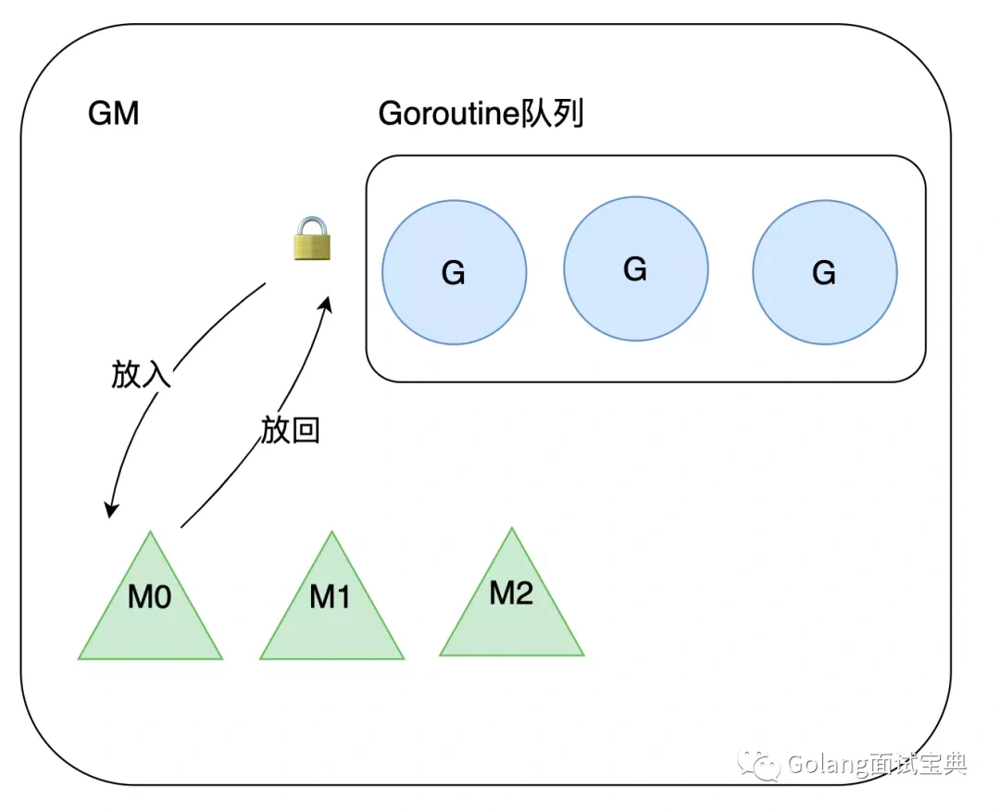
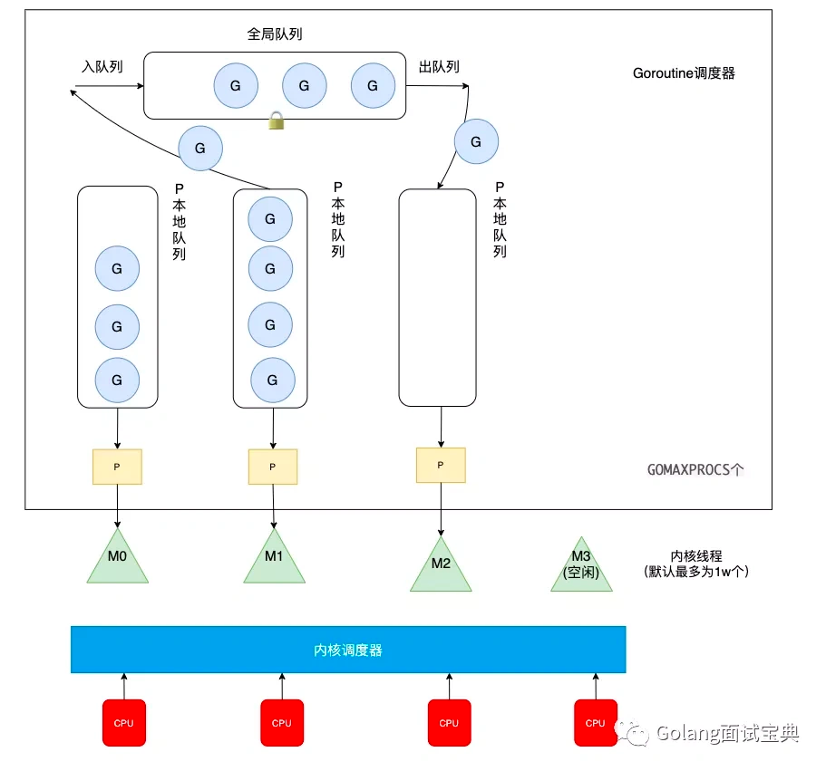

## GM模型

这是早期的goroutine管理模型

GM 模型中的 G 全称为 Goroutine 协程，M 全称为 Machine 内核级线程
M (内核线程) 从加锁的 Goroutine 队列中获取 G (协程) 执行，如果 G 在运行过程中创建了新的 G，那么新的 G 也会被放入全局队列中  
两个缺点  
1.一是调度，返回 G 都需要获取队列锁，形成了激烈的竞争  
2.二是 M 转移 G 没有把资源最大化利用。比如当 M1 在执行 G1 时，M1 创建了 G2，为了继续执行 G1，需要把 G2 交给 M2 执行，因为 G1 和 G2 是相关的，而寄存器中会保存 G1 的信息，因此 G2 最好放在 M1 上执行，而不是其他的 M  

**应运而生GMP**  

## GMP模型  

增加了一个p（Processor），由GOMAXPROCS()决定数量  
现在就不只是全局队列了，增加了p队列管理G  
  
当 P 中的本地队列中有协程 G 溢出时，会被放到全局队列中  
P 内置的 G 队列，存的数量有限，不超过 256 个  
两种情况分析  
1.一是当队列 P1 中的 G1 在运行过程中新建 G2 时，G2 优先存放到 P1 的本地队列中，如果队列满了，则会把 P1 队列中一半的 G 移动到全局队列  
2.二是如果 P 的本地队列为空，那么他会先到全局队列中获取 G，如果全局队列中也没有 G，则会尝试从其他线程绑定的 P 中偷取一半的 G  

M 的数量：go 程序启动时，会设置 M 的最大数量，默认 10000。但是内核很难创建出如此多的线程，因此默认情况下 M 的最大数量取决于内核。也可以调用 runtime/debug 中的 SetMaxThreads 函数，手动设置 M 的最大数量  

摘自 https://learnku.com/articles/57177

